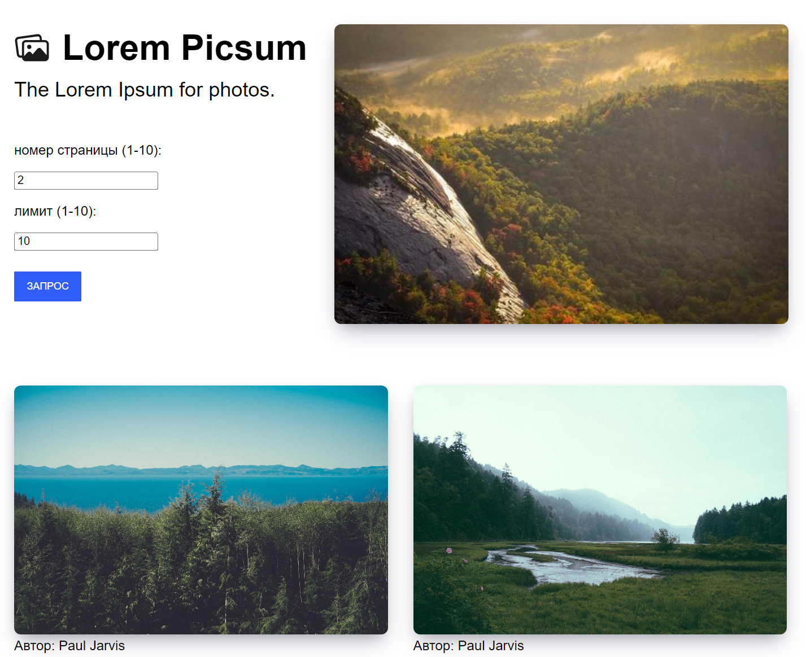

## Task 1

Преобразование XML в JS-объект

## Task 2

JS-объект, который при преобразовании в JSON будет возвращать в качестве результата JSON-строку

## Task 3

Запись и чтение из localStorage

## Task 4

Promise, в котором c задержкой в три секунды генерируется случайное целое число от 1 до 100

## Task 5

ToDoList

## Task 6

Приложение для загрузки и вывода на экран картинок со стороннего сайта

### Используемые технологии

* html, css, js (ajax)

### Как запустить

* скачать архив, открыть файлы .html в браузере. Для тасков 1, 2, 4: зайти в консоль.
